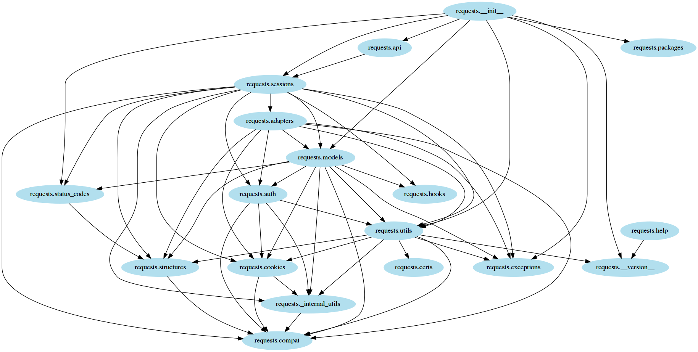
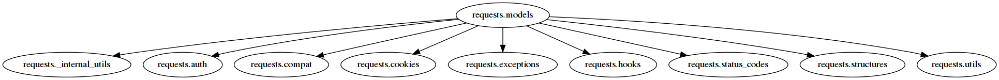
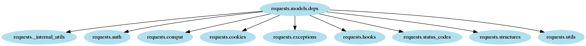

.. meta::
   :description: pydoit tutorial - walkthrough doit basic and intermediate concepts with real-world example
   :keywords: python, doit, tutorial, getting started, graph, graphviz, task-runner, pipeline

.. title:: pydoit tutorial - build a graph of module's imports

======================================
tutorial - python imports graph
======================================

This tutorial demonstrates how to use ``doit`` to create a simple computational pipeline.

The goal is to create a graph of python module's imports in a package.
`graphviz <http://graphviz.org/>`_'s **dot** tool will be used to generate the graph.

As an example, the `requests <https://github.com/requests/requests>`_ package will be used. The result is the image below:

In the image an arrow represents an import from one module to another. For example in the left side of image you can see an arrow from `requests.status_codes` to `requests.structures`. This comes from the following line in `status_code.py`:

.. code-block:: python3
   :caption: requests/status_codes.py

   from .structures import LookupDict

Drawing an "import" dependency graph can be very useful in understanding how the code in a package is organized.
It may also help you identify potential problems like circular imports.

There are three main steps to generate this graph:

1) read each python module and list its imports
2) generate a `dot` (text format) file representing the graph
3) generate an image (PNG) from the `dot` file

setup
=====

required python packages
------------------------

.. code-block:: console

  $ pip install doit pygraphviz import_deps

Note that on some linux systems it is necessary to install the system package `graphviz-dev` first.

sample project
--------------

First create a directory that will contain the projects to be analyzed.

.. code-block:: console

   $ mkdir projects

Then clone the ``requests`` project

.. code-block:: console

   $ cd projects
   $ git clone git@github.com:requests/requests.git
   $ cd ..

finding a module's import
=========================

Using `import_deps <https://github.com/schettino72/import-deps>`_ list all (intra-packages) imports from a module:

For example:

.. code-block:: console

    $ python -m import_deps projects/requests/requests/models.py
    requests._internal_utils
    requests.auth
    requests.compat
    requests.cookies
    requests.exceptions
    requests.hooks
    requests.status_codes
    requests.structures
    requests.utils

The output contains one imported module per line.

doit task
---------

On the next step we are going to wrap the above script in a ``doit`` *task*.
In ``doit`` tasks are defined in a plain python module, by default called ``dodo.py``.

For example, a trivial task to execute the script above and save its output into a file would be:

.. code-block:: python3
   :caption: dodo.py

    def task_imports():
        return {
            'actions': ['python -m import_deps '
                        'projects/requests/requests/models.py > requests.models.deps'],
        }

In this module you write functions that are **task-creators**,
the role of which is not to execute tasks but to return tasks' metadata.
**task-creators** are any function whose name starts with ``task_``.
A task name is taken from the function name, so
in this case the task is called ``imports``.

The most important *Task* metadata is ``actions``, which defines what will be done when a task is executed.

Note that ``actions`` is a list where its element are strings to be interpreted as shell commands.

task execution
--------------

``doit`` comes with a command line tool to act upon the set of tasks defined in a specific file. The default file is ``dodo.py`` in the current directory. With no argument it executes all tasks found in it.

.. code-block:: console

   $ doit
   .  imports

The output reports that the ``imports`` task was executed.
You can check that a file ``requests.models.deps`` was created with
a list of modules imported by ``requests.models``.

incremental computation
-----------------------

One of the main purposes of ``doit`` is to make use
of **up-to-date** checks to decide if tasks *need* to be executed or not.

In our case, as long as the input file is not modified we are certain
that the same output would be generated...

When dealing with files, task's metadata ``file_dep`` and ``targets`` can be used:

.. task_imports, line 11 is clean
.. literalinclude:: tutorial/tuto_1_1.py
   :language: python3
   :lines: 5-10,12

Note how ``actions`` can make use of variable substitution for
``%(dependencies)s`` and ``%(targets)s``.

Now let's execute it again:

.. code-block:: console

   $ doit
   .  imports

And then, a second time:

.. code-block:: console

   $ doit
   --  imports

Note that the second time there is a ``--`` instead of ``.`` preceding the task name.
This means that the task was not executed, ``doit`` understood that
the task output would be the same as previously generated,
so it does not execute the task again.

.. warning::

   When ``doit`` *loads* a ``dodo.py`` file it executes all *task-creator* functions in order to generate all tasks metadata.
   A task's ``action`` is only executed if the task is selected to run and not **up-to-date**.

   Expensive computation should always be done on task's ``action``
   and never on the body of a **task-creator** function.

rules for up-to-date checks on files
------------------------------------

file_dep
^^^^^^^^

``doit`` uses the *md5* of ``file_dep`` to determine if a dependency has changed.

.. code-block:: console

   $ touch projects/requests/requests/models.py
   $ doit
   -- imports
   $ echo "# comment" >> projects/requests/requests/models.py
   $ doit
   .  imports

Note that simply changing a file timestamp does not trigger a new execution.

targets
^^^^^^^

For ``targets``, the only verification that is made is whether the file exists or not.
So if a target is removed it will be re-created even if the dependencies remain unmodified.

.. code-block:: console

   $ rm requests.models.deps
   $ doit
   .  imports

graphviz dot
============

On the next step we will create a `graphviz <http://graphviz.org/>`_'s ``dot`` file.
``dot`` is a language to describe graphs.

The code below defines a python function to read a file containing
import dependencies (as generated by our previously defined ``imports`` task).

.. module_to_dot()
.. literalinclude:: tutorial/tuto_1_1.py
   :language: python3
   :lines: 1-3,14-15,18-27

Task with python action
-----------------------

Next we define the ``dot`` task, which is similar to previous tasks...
except for the fact that instead of passing a string with a shell command
we directly pass the previously created python function ``module_to_dot``.

.. task_dot()
.. literalinclude:: tutorial/tuto_1_1.py
   :language: python3
   :lines: 28-33,35

Also note that the function takes the special parameters ``dependencies`` and ``targets``, whose values will be injected by ``doit`` in the function call.

.. code-block:: console

   $ doit
   -- imports
   .  dot

To indicate a failure, a python-action should return the value ``False`` or raise an exception.

graph image
-----------

Finally lets add another task to generate an image from the `dot` file using the graphviz command line tool.

.. task_draw()
.. literalinclude:: tutorial/tuto_1_1.py
   :language: python3
   :lines: 38-43,45

.. code-block:: console

   $ doit
   -- imports
   -- dot
   .  draw

Opening the file ``requests.models.png`` you should get the image below:

doit command line
=================

``doit`` has a rich (and extensible) command line tool to manipulate your tasks. So far we have only executed ``doit`` without any parameters...

``doit`` command line takes the form of ``doit <sub-command> <options> <arguments>``,
where ``options`` and ``arguments`` are specific to the ``sub-command``.

If no sub-command is specified the default command ``run`` is used.
``run`` executes tasks...

doit help
---------

``doit help`` will list all available sub-commands.

You can get help for a specific sub-command with ``doit help <sub-command>``, i.e. ``doit help run``.

You can also get help for the task metadata fields with ``doit help task``.

doit list
---------

The command ``list`` displays the list of known tasks:

.. code-block:: console

   $ doit list
   dot       generate a graphviz's dot graph from module imports
   draw      generate image from a dot file
   imports   find imports from a python module

Note how the docstring from *task-creators* functions were used as tasks' description.

info
----

The ``info`` command can be used to get more information about a specific task's
metadata and state (whether it is up-to-date or not).

.. code-block:: console

   $ doit info imports

   imports

   find imports from a python module

   status     : up-to-date

   file_dep   :
     - projects/requests/requests/models.py

   targets    :
     - requests.models.deps

run
---

``run`` is the default command, and usually not explicitly typed.
So ``$ doit`` and ``$ doit run`` do exactly the same thing.

Without any parameters ``run`` will execute all of your tasks.
You can also select which tasks to be executed by passing a sequence of tasks' names.

For example if you want to execute only the ``imports`` task you would type:

.. code-block:: console

   $ doit imports
   -- imports

Note that even if you explicitly pass the name of the task to be executed,
``doit`` will actually execute the task only if it is not **up-to-date**.

You can also pass more than one task:

.. code-block:: console

   $ doit imports dot
   -- imports
   -- dot

Another important point to take notice of is that even
if you specify only one task, ``doit`` will run all of the dependencies of the specified task.

.. code-block:: console

   $ doit dot
   -- imports
   -- dot

Note how the ``imports`` task was run because task ``dot`` has ``file_dep`` that is a target of ``imports`` task.

clean
-----

A common use-case is to be able to "revert" the operations done by a task.
``doit`` provides the ``clean`` command for that.

By default it does nothing... You need to add the parameter ``clean`` to the task's metadata. For the most common case where you just want to remove the created targets, just pass the value ``True``.

You can also write custom ``actions`` (shell or python) to specify what should be done as a value to ``clean`` field.

Add ``clean`` to all defined tasks, like:

.. task_draw()
.. literalinclude:: tutorial/tuto_1_1.py
   :language: python3
   :lines: 38-45
   :emphasize-lines: 7

Executing ``clean``:

.. code-block:: console

   $ doit clean
   draw - removing file 'requests.models.png'
   dot - removing file 'requests.models.dot'
   imports - removing file 'requests.models.deps'

Since targets were removed this will force the tasks to be executed on next ``run``.

.. code-block:: console

   $ doit
   .  imports
   .  dot
   .  draw

forget
------

``doit`` will look for changes in the dependencies, but not for changes in the code that defines the tasks...
While developing a task, it is common to want to force its execution after making changes to it.

For example, let's change the colors of the nodes in the graph:

.. module_to_dot()
.. literalinclude:: tutorial/tuto_1_1.py
   :language: python3
   :lines: 14-21
   :emphasize-lines: 3-4

To force its execution we need ``doit`` to ``forget`` its state thus so:

.. code-block:: console

   $ doit forget dot
   forgetting dot

.. code-block:: console

   $ doit
   -- imports
   .  dot
   .  draw

.. note::

   Another option to force the execution of a task after code changes is to use `run``'s command option ``-a/--always-execute``. That will ignore the **up-to-date** check and always execute tasks.

Code :download:`dodo.py <tutorial/tuto_1_1.py>`.

Pipelines
=========

So far we have built a traditional "file" based pipeline where one task's target is used as a dependency for another task.

While ``doit`` provides first-class support for file based pipelines, they are not required.

get module imports - python
---------------------------

Let's rewrite the ``imports`` task to use a python action instead of a shell command:

.. task_imports()
.. literalinclude:: tutorial/tuto_1_2.py
   :language: python3
   :lines: 4-19
   :emphasize-lines: 8,15

The function ``get_imports`` is used as the task's action.
It returns a dictionary, which will be saved by ``doit`` in its internal database. The returned dictionary must contain only values that can be encoded as JSON.

``get_imports`` takes the path's module as a parameter (``module_path``). The value that will be used for this parameter upon task execution is specified in the ``actions`` of the task definition. Generally speaking, each element of the ``actions`` array is a tuple *(callable, args, kwargs)*.

.. note::

   Note in this example for simplicity we are using ``doit`` internal database, but it is also possible to use any other external database or data source.

getargs
-------

The task's parameter ``getargs`` can be used to extract values from another task's result and pass it as a parameter to the current task's action.
It's a dictionary of the form

.. code-block:: python

    {target_key: (task_name, source_key)}

and what it does is to execute the task ``task_name``, get the value of ``source_key`` from its resulting dict, and passing that as the argument named ``target_key`` of the current task's action.

.. task_dot()
.. literalinclude:: tutorial/tuto_1_2.py
   :language: python3
   :lines: 22-38
   :emphasize-lines: 1,14,15

Note how ``module_to_dot`` takes 3 parameters:

- ``source``: value is passed directly when the task's actions is defined
- ``sinks``: value is taken from ``imports`` task's result
- ``targets``: values is taken from Task metadata

Everything should work as before, but without the creation of intermediate files.

``doit`` can determine if the task ``imports`` is **up-to-date** even without a target file (it will just look at the ``file_dep``).

``doit`` can also determine if ``dot`` is **up-to-date** by comparing the value returned by ``imports`` (its dependency through the ``getargs`` parameter), with the value stored in its database.

Code :download:`dodo.py <tutorial/tuto_1_2.py>`.

package imports
===============

So far we have been creating a graph of a single module.
Let's process all modules in the package.

``doit`` has the concept of a **task-group**.
A task group performs the same operation over a set of instances.
To create a task group the task-creator function should ``yield`` one or more task dictionaries with task metadata.

Note that each task is still independent.
Since each task needs to be independently identified an extra parameter ``name`` must be provided.

.. task_imports()
.. literalinclude:: tutorial/tuto_1_3.py
   :language: python3
   :lines: 8-22
   :emphasize-lines: 4,11,12

Sub-tasks (items of task group) by default are not reported by the ``list`` command. They can be displayed, though, using the ``--all`` flag.

.. code-block:: console

   $ doit list
   dot       generate a graphviz's dot graph from module imports
   draw      generate image from a dot file
   imports   find imports from a python module

.. code-block:: console

   $ doit list --all imports
   imports                            find imports from a python module
   imports:requests.__init__
   imports:requests.__version__
   imports:requests._internal_utils
   imports:requests.adapters
   imports:requests.api
   imports:requests.auth
   imports:requests.certs
   imports:requests.compat
   imports:requests.cookies
   imports:requests.exceptions
   imports:requests.help
   imports:requests.hooks
   imports:requests.models
   imports:requests.packages
   imports:requests.sessions
   imports:requests.status_codes
   imports:requests.structures
   imports:requests.utils

Note the task's name is composed of the task's group name (aka ``basename``)
followed by a colon `:` and the ``name`` specified as a parameter when ``yield``.

From the command line, a single task can be executed like this::

  $ doit imports:requests.models
  .  imports:requests.models

getargs from group-task
-----------------------

``getargs`` can also be used to get values from a *group-task*.
The difference is that its value will be a dictionary where the
key is the sub-task name:

.. task_dot()
.. literalinclude:: tutorial/tuto_1_3.py
   :language: python3
   :lines: 25-41
   :emphasize-lines: 5,13-15

Finally, adjust task ``draw``.

.. task_draw()
.. literalinclude:: tutorial/tuto_1_3.py
   :language: python3
   :lines: 44-51
   :emphasize-lines: 4-5

Running ``doit`` you should get the file ``requests.png`` with the image below:

Code :download:`dodo.py <tutorial/tuto_1_3.py>`.

printing imports
================

Getting rid of intermediate computation files (like ``requests.models.deps``) was nice...
but sometimes it is useful to be able to quickly list the direct imports from a module.

Let's create another task that just prints its output in the terminal.

.. task_print()
.. literalinclude:: tutorial/tuto_1_4.py
   :language: python3
   :lines: 12-14, 32-44
   :emphasize-lines: 14-15

Here again we used a **task-group** to create one task per python module and ``getargs`` to extract the list of modules' imports from ``imports``'s result.

Also note the usage of two metadata fields not seen before: ``uptodate`` and ``verbosity``.

custom `uptodate`
-----------------

So far we have seen how ``doit`` can determine if a task is **up-to-date** by taking into consideration changes to ``file_dep``, if ``targets`` exist and results from ``getargs`` have changed.

While those cover a wide range of use cases, ``doit`` also provides a way to specify completely custom checks for  **up-to-date**, using the ``uptodate`` field.

In this case the ``print`` task actually does not perform any computation, it is being used to display some info to the user.
So this task should be **always** executed.

``uptodate`` will be explained in detail in part 2 of this tutorial.
For now it suffices to add the value ``False`` to indicate this task will never be considered **up-do-date**.

.. code-block:: python

   'uptodate': [False],

verbosity
---------

``doit`` output (for command ``run``) consists of:

- one line with task name (preceded by `.` or `--`)
- task's output

The actual task's output displayed can be controlled by ``verbosity``.
There are 3 levels of verbosity.

- 0: both stdout and stderr from the task are **NOT** displayed
- 1: only stderr is displayed
- 2: both stdout and stderr are displayed

The default verbosity is `1`.

If the ``print`` task would be executed with the default verbosity we would actually not see any output, so we must force its ``verbosity`` value to ``2``.

.. code-block:: python3

   'verbosity': 2,

.. code-block:: console

   $ doit print:requests.models
   -- imports:requests.models
   .  print:requests.models
   requests._internal_utils
   requests.auth
   requests.compat
   requests.cookies
   requests.exceptions
   requests.hooks
   requests.status_codes
   requests.structures
   requests.utils

Note ``verbosity`` can be overwritten from command-line with option ``-v/--verbosity``.

DOIT_CONFIG
-----------

There is one last problem to be solved.
Since ``print`` is used only to display some information, it should not be executed by default. It should be executed only when explicitly asked.

i.e. when you just run ``doit`` without any parameters it should create the graph image but not print out the information from ``print`` task.

Before I said that by default ``doit run`` would execute all tasks.
That is not exactly true... it will execute all *default tasks*.
The default tasks can be controlled by adding a configuration dictionary with the name ``DOIT_CONFIG`` in the `dodo.py`.

.. DOIT_CONFIG
.. literalinclude:: tutorial/tuto_1_4.py
   :language: python3
   :lines: 7-9

Apart from ``default_tasks``, ``DOIT_CONFIG`` can change the default of any command line option. For example you can globally change every task's ``verbosity`` level:

.. code-block:: python3

   DOIT_CONFIG = {
    'default_tasks': ['imports', 'dot', 'draw'],
    'verbosity': 2,
   }

Code :download:`dodo.py <tutorial/tuto_1_4.py>`.

And that's all for part 1 of tutorial :)
